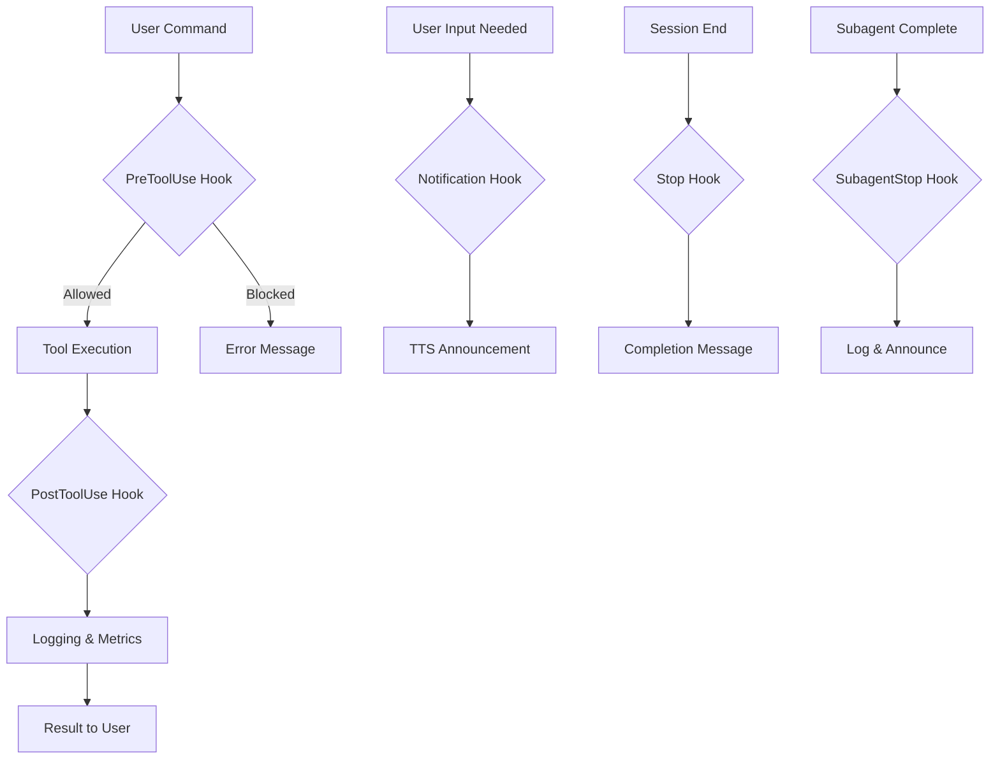

# 🤖 Claude Code Configuration - Ultimate Setup Guide

> **The most comprehensive Claude Code configuration for maximum developer productivity**

This directory contains an advanced Claude Code integration setup with intelligent hooks, automated workflows, and productivity enhancements that transform your development experience.

## 🏗️ Architecture Overview

```
.claude/
├── settings.json          # 🔧 Base Claude configuration
├── settings.local.json    # 👤 Developer-specific overrides
├── commands/              # 🚀 Quick-access command templates
├── hooks/                 # 🪝 Event-driven automation
│   ├── dev/              # Development hooks
│   ├── logs/             # Hook execution logs
│   └── utils/            # Shared utilities
└── hooks/dev/optimize.py  # 🛠️ Configuration optimizer
```

## ⚡ Key Features

### 🛡️ Security-First Design
- **Pre-execution validation** blocks dangerous operations
- **Protected paths** prevent accidental system damage
- **Sensitive file protection** for .env and credentials
- **Audit logging** tracks all tool usage

### 🔊 Smart Notifications
- **Text-to-Speech alerts** when Claude needs input
- **Multiple TTS providers** (ElevenLabs, OpenAI, pyttsx3)
- **Personalized messages** with engineer name support
- **Intelligent filtering** avoids redundant notifications

### 📊 Performance Monitoring
- **Real-time metrics** track tool execution times
- **Usage analytics** identify optimization opportunities
- **Performance recommendations** based on patterns
- **Historical data** for trend analysis

### 🤖 AI-Powered Features
- **Dynamic completion messages** using LLM services
- **Intelligent code review** with LEVER methodology
- **Context-aware suggestions** for optimization
- **Multi-provider support** (OpenAI, Anthropic)

## 🪝 Hook System

### Hook Execution Flow



### Pre-Tool Hook (`hooks/dev/pre.py`)
**Purpose:** Security validation before tool execution

**Features:**
- 🚫 Blocks dangerous `rm -rf` commands on critical paths
- 🔒 Prevents access to `.env` files (allows `.env.sample`)
- 📝 Logs all tool calls to `logs/pre.json`
- ✅ Returns exit code 2 to block dangerous operations

**Protected Paths:**
- Root directory (`/`)
- Home directory (`~`, `$HOME`)
- Parent directory (`..`)
- Wildcards (`*`)
- Current directory (`.`)

### Post-Tool Hook (`hooks/dev/post.py`)
**Purpose:** Logging and metrics after tool execution

**Features:**
- 📊 Records execution results
- 🕒 Tracks timing information
- 💾 Maintains complete history
- 🔇 Silent failure handling

### Notification Hook (`hooks/dev/notify.py`)
**Purpose:** Alert when Claude needs user input

**Features:**
- 🔊 Multi-provider TTS support
- 👤 Personalized messages (30% probability)
- 🎯 Smart message filtering
- 📝 Event logging to `logs/notify.json`

**TTS Provider Priority:**
1. ElevenLabs (fastest, highest quality)
2. OpenAI (good quality, reliable)
3. pyttsx3 (offline fallback)

### Stop Hook (`hooks/dev/stop.py`)
**Purpose:** Session completion handling

**Features:**
- 🎉 Dynamic completion messages via LLM
- 📢 TTS announcements
- 📄 Chat transcript export
- 🎲 Fallback message pool

**Default Messages:**
- "Work complete!"
- "All done!"
- "Task finished!"
- "Job's done!"
- "Mission accomplished!"

### SubagentStop Hook (`hooks/dev/agent.py`)
**Purpose:** Subagent completion tracking

**Features:**
- 📊 Subagent performance logging
- 🔊 Completion announcements
- 📝 Transcript management
- 🔄 JSONL to JSON conversion

### Configuration Optimizer (`hooks/dev/optimize.py`)
**Purpose:** Optimizes Claude configuration files by removing redundancies

**Features:**
- 🔄 Deduplicates permissions in settings files
- 📁 Groups permissions logically (CLI, Python, Ansible, Git, Docker, file_ops, scripts, other)
- 🔀 Merges hooks from base and local settings files
- 📊 Generates optimization reports with reduction statistics
- 💾 Saves optimized permissions back to settings.local.json

**Benefits:**
- Can achieve 30-50% permission reduction
- Intelligent grouping for better organization
- Preserves local settings priority
- Clean, organized configuration files

### Performance Monitor (`hooks/dev/perf.py`)
**Purpose:** Advanced performance analytics

**Features:**
- ⏱️ Tool execution timing
- 📈 Aggregated statistics
- 💡 Usage-based recommendations
- 🎯 Optimization suggestions

**Metrics Tracked:**
- Execution count per tool
- Average/min/max duration
- Input size analysis
- Slowest operations
- Most-used tools

**Recommendations:**
- Batch operations over 100ms
- Use Task tool for high-frequency operations (>100 calls)
- Optimize slow file operations

## 📋 Command Templates

### `prime.md` - Project Context Loader
```bash
# Quickly load project context for new sessions
claude code run .claude/commands/prime.md
```
- Maps codebase structure
- Loads key documentation
- Provides project overview
- Restricted tool access

### `principles.md` - LEVER Code Review
```bash
# Run comprehensive code review
claude code run .claude/commands/principles.md
```
- **L**ocate: Find existing code (0-2 points)
- **E**xtend: Reuse patterns (0-2 points)
- **V**alidate: Test approach (0-2 points)
- **E**nhance: Improve quality (0-2 points)
- **R**educe: Minimize complexity (0-2 points)

**Minimum Score:** 7/10 to proceed

### `git.md` - Repository Status
```bash
# Quick git status check
claude code run .claude/commands/git.md
```
- Current branch
- Working directory status
- Diff from main branch

### `dev.md` - Development Notes
- Architecture decisions
- Version tracking
- Service patterns
- Special cases

### `sentient.md` - Security Demo
- Tests safety mechanisms
- Validates command blocking
- Demo purposes only

## 🛠️ Utility Libraries

### TTS Providers (`hooks/utils/tts/`)

#### ElevenLabs (`elevenlabs.py`)
- **Model:** Turbo v2.5
- **Features:** Fastest, highest quality
- **Requirements:** `ELEVENLABS_API_KEY`

#### OpenAI (`openai.py`)
- **Model:** TTS-1
- **Features:** Good quality, reliable
- **Requirements:** `OPENAI_API_KEY`

#### Pyttsx3 (`pytts.py`)
- **Features:** Offline, cross-platform
- **Requirements:** None (system TTS)

### LLM Providers (`hooks/utils/llm/`)

#### OpenAI (`oai.py`)
- **Model:** GPT-4
- **Use:** Dynamic message generation
- **Requirements:** `OPENAI_API_KEY`

#### Anthropic (`anth.py`)
- **Model:** Claude
- **Use:** Fallback LLM provider
- **Requirements:** `ANTHROPIC_API_KEY`

## 📊 Logging Structure

### Log Files
```
logs/
├── pre.json          # Pre-execution validation logs
├── post.json         # Post-execution results
├── notify.json       # Notification events
├── stop.json         # Session completion logs
├── agent.json        # Subagent events
├── chat.json         # Exported chat transcripts
├── tts_debug.log     # TTS debugging information
└── metrics/
    ├── perf.json     # Raw performance data
    └── perfs.json    # Aggregated statistics
```

### Log Analysis Examples

#### Find most-used tools:
```bash
jq -r '.tool' logs/post.json | sort | uniq -c | sort -nr
```

#### Check blocked operations:
```bash
jq 'select(.blocked == true)' logs/pre.json
```

#### Analyze performance:
```bash
jq '.summary' logs/metrics/perfs.json
```

## 🚀 Workflows & Best Practices

### Initial Setup
1. **Copy settings template:**
   ```bash
   cp .claude/settings.local.json.example .claude/settings.local.json
   ```

2. **Configure environment:**
   ```bash
   # Add to .env
   ENGINEER_NAME="Your Name"
   ELEVENLABS_API_KEY="your-key"
   OPENAI_API_KEY="your-key"
   ```

3. **Test hooks:**
   ```bash
   # Test TTS
   python .claude/hooks/dev/notify.py --test
   
   # Test security
   claude code run .claude/commands/sentient.md
   ```

### Optimizing Configuration
```bash
# Run optimization script
python .claude/hooks/dev/optimize.py

# Review optimization report
cat .claude/hooks/logs/optimization_report.json
```

### Monitoring Performance
```bash
# Real-time monitoring
tail -f logs/metrics/perf.json | jq

# Generate report
python .claude/hooks/dev/perf.py --report
```

### Debugging Issues
1. **Check hook logs:**
   ```bash
   # Recent errors
   tail -n 50 logs/*.json | jq 'select(.error)'
   ```

2. **Test specific hooks:**
   ```bash
   # Test pre-hook validation
   echo '{"tool": "Bash", "args": {"command": "rm -rf /"}}' | python .claude/hooks/dev/pre.py
   ```

3. **Enable debug mode:**
   ```bash
   export CLAUDE_DEBUG=1
   ```

## 🔧 Configuration Reference

### settings.json Structure
```json
{
  "project": {
    "name": "Project Name",
    "description": "Project description",
    "type": "project-type",
    "languages": ["python", "yaml"],
    "cli_command": "cli",
    "python_module": "module.path"
  },
  "context": {
    "architecture": {},
    "key_flows": {},
    "vault_variables": {},
    "recent_changes": {}
  },
  "permissions": {
    "allow": [],
    "deny": []
  },
  "hooks": {
    "PreToolUse": [],
    "PostToolUse": [],
    "Notification": [],
    "Stop": [],
    "SubagentStop": []
  }
}
```

### Hook Configuration
```json
{
  "matcher": "Write|Edit|MultiEdit",
  "hooks": [{
    "type": "command",
    "command": "path/to/hook.py"
  }]
}
```

## 🚨 Troubleshooting

### Common Issues

#### TTS Not Working
- **Check API keys:** Ensure environment variables are set
- **Test providers:** Run with `--test` flag
- **Check logs:** Review `logs/tts_debug.log`

#### Hooks Not Executing
- **Verify permissions:** Ensure hooks are executable (`chmod +x`)
- **Check paths:** Verify hook paths in settings.json
- **Test manually:** Run hooks directly with test data

#### Performance Issues
- **Review metrics:** Check `logs/metrics/perfs.json`
- **Batch operations:** Follow recommendations for slow tools
- **Optimize permissions:** Run optimization script

### Debug Commands
```bash
# Test all hooks
for hook in .claude/hooks/dev/*.py; do
  echo "Testing $hook..."
  python "$hook" --test
done

# Check configuration
python -m json.tool .claude/settings.json

# Validate permissions
grep -E "^[[:space:]]*\"(allow|deny)\":" .claude/settings.json -A 20
```

## 🎯 Advanced Features

### Custom Hook Development
```python
#!/usr/bin/env python
"""Template for custom hooks"""

import json
import sys
from pathlib import Path

class CustomHook:
    def __init__(self):
        self.log_file = Path(".claude/hooks/logs/custom.json")
    
    def process(self, data):
        # Your logic here
        return {"success": True}
    
    def run(self):
        try:
            data = json.loads(sys.stdin.read())
            result = self.process(data)
            self.log(result)
            return 0 if result["success"] else 1
        except Exception as e:
            self.log({"error": str(e)})
            return 0  # Fail silently

if __name__ == "__main__":
    sys.exit(CustomHook().run())
```

### Performance Optimization Tips
1. **Batch file operations** when possible
2. **Use Task tool** for complex searches
3. **Cache frequent lookups** in local settings
4. **Minimize hook execution time** (<50ms target)
5. **Leverage parallel processing** in hooks

### Security Hardening
1. **Restrict permissions** to minimum required
2. **Regular audit** of allowed commands
3. **Environment isolation** for sensitive data
4. **Hook validation** before deployment
5. **Log monitoring** for suspicious activity

## 📚 Additional Resources

### Environment Variables
- `ENGINEER_NAME` - Your name for personalized messages
- `ELEVENLABS_API_KEY` - ElevenLabs API key
- `OPENAI_API_KEY` - OpenAI API key
- `ANTHROPIC_API_KEY` - Anthropic API key
- `CLAUDE_DEBUG` - Enable debug logging
- `ANSIBLE_VAULT_PASSWORD_FILE` - Vault password location

### File Patterns
- `*.json` - Configuration and log files
- `*.py` - Hook implementations
- `*.md` - Command templates
- `.env*` - Environment configuration

### Best Practices Summary
1. ✅ Keep permissions minimal and organized
2. ✅ Use hooks for validation and monitoring
3. ✅ Review performance metrics regularly
4. ✅ Update local settings rather than base
5. ✅ Document custom commands clearly
6. ✅ Test hooks before deployment
7. ✅ Monitor logs for issues
8. ✅ Optimize based on metrics
9. ✅ Secure sensitive data
10. ✅ Maintain clean architecture

---

## 🎉 Conclusion

This Claude Code configuration represents the pinnacle of AI-assisted development setup. With intelligent hooks, performance monitoring, security validation, and productivity enhancements, it transforms Claude Code from a simple AI assistant into a comprehensive development partner.

**Key Benefits:**
- 🚀 **10x productivity** through automation
- 🛡️ **Enterprise-grade security** with validation
- 📊 **Data-driven optimization** via metrics
- 🔊 **Seamless notifications** keep you informed
- 🤖 **AI-powered workflows** enhance quality

Start using these features today and experience the future of AI-assisted development!

---

*Built with ❤️ for the Claude Code community*