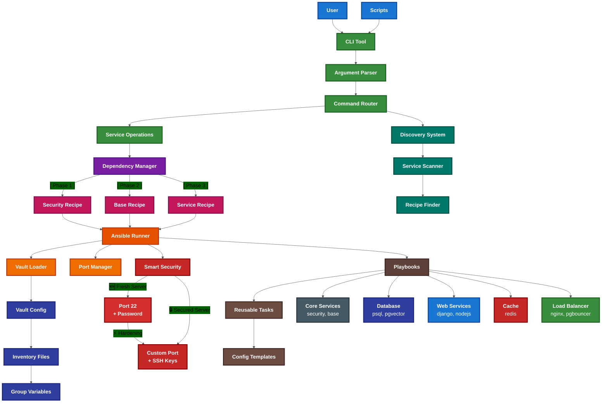

# Ansible Cloudy - Infrastructure Automation

**Ansible Cloudy** is a comprehensive infrastructure automation toolkit featuring the **CLI** - an intelligent command-line interface that simplifies server deployment and management through Ansible playbooks.

## 🚀 Key Features

- **🔐 Enterprise Security**: Two-phase authentication with SSH keys and secure firewall configuration
- **🧠 Intelligent CLI**: Auto-discovery of services and operations with intuitive parameter mapping
- **⚡ Universal Parameters**: `cli redis --install --port 6380 --memory 512` instead of complex Ansible variables
- **🔄 Granular Operations**: Service-specific tasks like `cli psql --adduser foo --password 1234`
- **🛡️ Production-Ready**: Secure defaults, comprehensive validation, and enterprise-grade security model
- **🚀 New Deployment Flavors**: pgvector for AI/ML, Node.js with PM2, standalone all-in-one deployments
- **⚙️ Production Hardening**: Kernel security, SSH hardening, audit logging, DDoS protection
- **🔌 Connection Pooling**: PgBouncer integration for optimal database performance

## Quick Start

### Installation
```bash
# Bootstrap environment (recommended)
./bootstrap.sh
source .venv/bin/activate

# Or install manually
pip install ansible
```

> **💡 Tip:** After activation, you can use either `cli` or its short alias `cli`. Both commands are identical - `cli` saves keystrokes for frequent use.

### Basic Usage
```bash
# Show help and configuration options (default action)
cli security    # View security setup help and available variables
cli psql        # View PostgreSQL setup help and configuration
cli redis       # View Redis setup help and all parameters

# Execute recipes with universal parameter support
cli security --install                           # Security setup (admin user, SSH keys, firewall)
cli base --install                               # Base configuration (hostname, git, timezone, docker)
cli finalize --install                           # System upgrades, optional port change, reboot
cli psql --install --port 5544 --pgis           # PostgreSQL with PostGIS on custom port
cli redis --install --port 6380 --memory 512    # Redis with custom port and memory
cli nginx --install --domain example.com --ssl  # Nginx with SSL domain

# Environment selection
cli psql --install --dev                        # Use dev environment (default)
cli psql --install --prod                       # Use production environment
cli psql --install --ci                         # Use CI environment
cli psql --install -i custom-inventory.yml      # Use custom inventory file

# New deployment flavors
cli pgvector --install --dimensions 1536        # PostgreSQL with AI/ML embeddings
cli nodejs --install --app-name api --pm2      # Node.js with PM2 process manager
cli standalone --install --app-type django     # All-in-one server deployment

# Granular operations (no recipe installation)
cli psql --adduser myuser --password secret123  # Add PostgreSQL user
cli redis --configure-port 6379                 # Change Redis port
cli nginx --setup-ssl example.com               # Setup SSL for domain
cli pgbouncer --configure-port 6433            # Configure connection pooler
```

## 🏗️ Architecture Overview

### CLI - Intelligent Command Interface
The **CLI** is the heart of Ansible Cloudy, providing:

- **🔍 Auto-Discovery**: Services and operations automatically discovered from filesystem
- **📋 Universal Parameters**: Intuitive CLI with `--port`, `--domain`, `--ssl` instead of complex Ansible variables
- **🎯 Granular Operations**: Service-specific tasks without full recipe installation
- **🔒 Smart Security**: Two-phase authentication model with connection validation
- **📊 Clean Output**: Shows only changes and failures by default

### Service Categories
- **Core**: `security`, `base` - Foundation server setup with production hardening
- **Database**: `psql`, `postgis`, `pgvector` - PostgreSQL with spatial and AI/ML extensions
- **Web**: `django`, `nodejs`, `nginx` - Web applications and load balancing
- **Cache**: `redis` - High-performance caching with persistence
- **Connection Pooling**: `pgbouncer` - Database connection optimization
- **VPN**: `openvpn` - Secure remote access
- **Standalone**: `standalone` - All-in-one server deployment
- **Development**: `dev` - Validation and testing tools

### Security Model
- **🔑 SSH Key Authentication**: Root access via SSH keys only (no password brute force)
- **👤 Admin Emergency Access**: Dual authentication (password + SSH keys) for manual operations
- **🔥 Smart Firewall**: UFW automatically configured with service-specific ports
- **🚪 Custom SSH Port**: Default port 2222 with seamless migration
- **🛡️ Enterprise Hardening**: Fail2ban, connection limits, secure SSH configuration
- **🔒 Kernel Security**: Hardened sysctl parameters, ASLR, secure shared memory
- **📝 Audit Logging**: Comprehensive audit trail with auditd and logrotate
- **🚫 DDoS Protection**: Rate limiting, connection throttling, SYN flood protection
- **🔐 Secure Ciphers**: Modern encryption algorithms, disabled weak protocols

### 📊 Output Control
```bash
# Show help by default (safe exploration)
cli security

# Execute with clean output (show only changes and failures)
cli security --install

# Compact output
ANSIBLE_STDOUT_CALLBACK=minimal cli security --install

# Verbose debugging
cli security --install -v
```

## 📁 Project Structure

```
ansible-cloudy/
├── cli                    # Main CLI entry point
├── bootstrap.sh              # Environment setup script
├── cloudy/                   # Ansible automation core
│   ├── playbooks/recipes/    # High-level deployment recipes
│   │   ├── core/            # security.yml, base.yml
│   │   ├── db/              # psql.yml, postgis.yml, pgvector.yml
│   │   ├── www/             # django.yml, nodejs.yml
│   │   ├── cache/           # redis.yml
│   │   ├── lb/              # nginx.yml, pgbouncer.yml
│   │   ├── vpn/             # openvpn.yml
│   │   └── standalone/      # all-in-one.yml
│   ├── tasks/                # Granular, reusable task files
│   │   ├── sys/             # System operations (SSH, firewall, users)
│   │   ├── db/              # Database automation (PostgreSQL)
│   │   ├── web/             # Web server management
│   │   └── services/        # Service management (Docker, Redis, VPN)
│   ├── templates/           # Configuration file templates
│   ├── inventory/           # Server inventory configurations
│   └── ansible.cfg          # Ansible configuration
├── dev/                     # Development tools and CLI implementation
│   ├── cli/                 # Python CLI implementation
│   │   ├── cmd/             # Command parsing and routing
│   │   ├── operations/      # Service-specific operations
│   │   ├── discovery/       # Auto-discovery of services
│   │   ├── execution/       # Ansible execution engine
│   │   └── utils/           # Configuration and utilities
│   └── validate.py         # Development validation tools
└── docs/                   # Project documentation
    ├── getting-started/    # New user guides
    ├── architecture/       # System design docs
    ├── development/        # Developer guides
    ├── operations/         # User guides
    └── reference/          # Technical reference
```

## ⚙️ Configuration

### 1. Server Inventory
Configure servers in `cloudy/inventory/dev.yml`:
```yaml
all:
  vars:
    ansible_user: admin         # Connect as admin user (after setup)
    ansible_port: 2222         # Custom SSH port
    ansible_host_key_checking: false
    
  children:
    generic_servers:
      hosts:
        my-server:
          ansible_host: 10.10.10.100
          hostname: my-server.example.com
          admin_user: admin
          admin_password: secure123
```

### 2. Vault Configuration (Recommended)
For production deployments, create vault files to store credentials separately:
```bash
# Copy vault template
cp .vault/dev.yml.example .vault/my-dev.yml

# Edit with your credentials (keep this file private!)
vim .vault/my-dev.yml
```

**⚠️ Important**: `.vault/*.yml` files contain sensitive credentials and should NEVER be committed to git. Only `.vault/*.example` templates are tracked.

Example vault content:
```yaml
vault_root_password: "secure_root_password_123"
vault_grunt_password: "secure_grunt_password_456"
vault_grunt_user: "grunt"
vault_ssh_port: 2222
```

### 3. Two-Phase Authentication Model
**Phase 1 - Initial Security Setup** (Root + Password):
```yaml
# For fresh servers - inventory configuration
ansible_user: root
ansible_ssh_pass: "{{ vault_root_password }}"
ansible_port: 22
```

**Phase 2 - Service Operations** (Root + SSH Keys):
```yaml
# After hardening - inventory configuration
ansible_user: "{{ vault_root_user }}"
ansible_port: "{{ vault_ssh_port }}"
# Now using SSH keys only, no passwords
```

## 🎯 Workflow Examples

### Complete Web Application Stack
```bash
# Step 1: Harden SSH access (install keys, disable passwords, change port)
cli harden --install

# Step 2: Secure server foundation (creates grunt user, firewall, monitoring)
cli security --install

# Or for production environments with maximum security:
# cli security --install --production-hardening

# Step 3: Base server configuration (hostname, git, timezone, docker)
cli base --install

# Step 4: Database layer with custom parameters
cli psql --install --port 5544 --pgis

# Step 5: Web application layer
cli django --install

# Step 6: Load balancer with SSL domain
cli nginx --install --domain example.com --ssl

# Step 7: Finalize with system upgrades and optional SSH port change
cli finalize --install                    # Upgrades and reboot if needed
# cli finalize --install --change-port    # Also change SSH to port 2222
```

### Redis Cache Server with Custom Configuration
```bash
# View Redis configuration options
cli redis

# Install Redis with custom port and memory limit
cli redis --install --port 6380 --memory 512 --password secret123

# Granular operations (without recipe installation)
cli redis --configure-port 6379    # Change port
cli redis --set-password newpass   # Update password
```

### PostgreSQL Database Management
```bash
# Install PostgreSQL with PostGIS on custom port
cli psql --install --port 5544 --pgis

# Database user management (granular operations)
cli psql --adduser myapp --password secret123
cli psql --adddb myapp_db --owner myapp
cli psql --list-users
cli psql --list-databases
```

### VPN Server Deployment
```bash
# View OpenVPN configuration options
cli openvpn

# Deploy complete VPN server with Docker
cli openvpn --install
```

### PostgreSQL with pgvector for AI/ML
```bash
# View pgvector configuration options
cli pgvector

# Install PostgreSQL with pgvector extension
cli pgvector --install --dimensions 1536 --index-type hnsw

# Production deployment with custom settings
cli pgvector --install --prod --port 5433 --create-examples
```

### Node.js Application Deployment
```bash
# View Node.js deployment options
cli nodejs

# Deploy Node.js application with PM2
cli nodejs --install --app-repo https://github.com/user/app.git

# Production deployment with domain and SSL
cli nodejs --install --prod --domain api.example.com --ssl --pm2-instances 4
```

### Standalone All-in-One Server
```bash
# View standalone deployment options
cli standalone

# Deploy complete stack on single server
cli standalone --install --app-type django --domain example.com --ssl

# Custom configuration with specific components
cli standalone --install --with-postgresql --with-redis --pg-port 5433
```

### Database Connection Pooling with PgBouncer
```bash
# Install PgBouncer on web servers
cli pgbouncer --install

# Configure with custom settings
cli pgbouncer --install --port 6433 --pool-size 30

# Granular operations
cli pgbouncer --configure-port 6433
cli pgbouncer --set-pool-size 50
```

## 🧪 Development & Validation

Ansible Cloudy includes comprehensive development tools:

```bash
# Environment setup
./bootstrap.sh                    # Setup Python virtual environment with all tools
source .venv/bin/activate         # Activate development environment

# Validation commands via CLI
cli dev syntax              # Quick syntax check
cli dev validate            # Comprehensive validation suite
cli dev lint                # Ansible linting with rules
cli dev test                # Authentication flow testing
cli dev spell               # Spell check documentation

# Direct development tools
./dev/validate.py                 # Python validation script
./dev/syntax-check.sh             # Shell syntax validation
```

**Development Features:**
- ✅ **Auto-Discovery**: Services automatically discovered from filesystem
- ✅ **Universal Parameters**: Smart parameter mapping for all services
- ✅ **Comprehensive Validation**: YAML, Ansible, inventory, and template validation
- ✅ **Clean Architecture**: Modular design with clear separation of concerns
- ✅ **File Size Limits**: All files kept under 200 LOC for maintainability

## 🧪 Testing & Scripts

### Utility Scripts
The `scripts/` directory contains helpful testing and deployment scripts:

```bash
# Quick syntax validation
./scripts/test/test-simple.sh

# Verify variable mappings
./scripts/verify/verify-variable-mapping.sh

# Full integration test with Docker
./scripts/test/run-complete-test.sh

# Check if a server needs hardening
./scripts/examples/check-server-status.sh <server-ip>

# Deploy to a fresh server (example)
./scripts/examples/deploy-fresh-server.sh
```

See `scripts/README.md` for detailed documentation.

## 📚 Documentation

### Quick Access
- **🚀 [Quick Start](docs/getting-started/quickstart.md)** - Get up and running in 5 minutes
- **📦 [Installation Guide](docs/getting-started/installation.md)** - Detailed setup instructions
- **📖 [Command Reference](docs/operations/commands.md)** - All available commands
- **🍱 [Deployment Recipes](docs/operations/recipes.md)** - Pre-built deployment patterns

### In-Depth Guides
- **🏗️ [Architecture Overview](docs/architecture/overview.md)** - How Ansible Cloudy works
- **🔐 [Authentication Flow](docs/architecture/authentication-flow.md)** - Security model explained
- **⚙️ [Configuration Guide](docs/operations/configuration.md)** - Vault and inventory setup
- **🛠️ [Development Guide](docs/development/guide.md)** - Contributing to the project

### Reference
- **📊 [Variable Reference](docs/reference/variables.md)** - All configurable variables
- **🔧 [Troubleshooting](docs/reference/troubleshooting.md)** - Common issues and solutions
- **📝 [Changelog](docs/reference/changelog.md)** - Version history

See the complete **[Documentation Index](docs/README.md)** for all available guides.

## 🎯 Key Benefits

- **🔄 Idempotent Operations**: Tasks only run when changes are needed
- **🛡️ Enterprise Security**: Two-phase authentication with SSH keys and firewall automation
- **🧠 Intelligent CLI**: Auto-discovery with intuitive parameter mapping
- **📊 Clean Output**: Focus on changes and failures, hide unchanged tasks
- **🏗️ Modern Tooling**: Industry-standard Ansible with intelligent Python CLI layer
- **📈 Production Ready**: Secure defaults, comprehensive validation, vault integration
- **🔧 Developer Friendly**: Granular operations, modular architecture, extensive documentation
- **🚀 AI/ML Ready**: PostgreSQL with pgvector for embedding storage and similarity search
- **⚡ High Performance**: Connection pooling, optimized configurations, resource-aware tuning
- **🎯 Deployment Flexibility**: Single server standalone or distributed multi-tier architectures
- **🔒 Security First**: Kernel hardening, audit logging, DDoS protection built-in

## 🏗️ Architecture Flow



## 🤝 Contributing

**Quick Start**: Fork the repo → run `./bootstrap.sh` → make changes → run `cli dev validate` → commit → PR

See [docs/CONTRIBUTING.md](docs/CONTRIBUTING.md) for detailed development guidelines and workflow.
