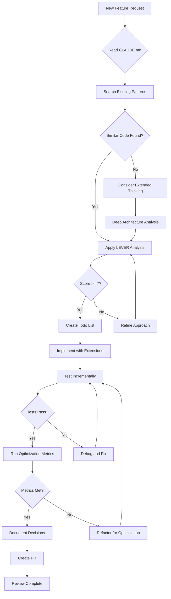

# Optimization Workflow Diagram

## 🔄 Complete Development Workflow



## 📊 LEVER Score Calculation

```
┌─────────────────────────────────────────┐
│          LEVER SCORING MATRIX           │
├─────────────┬───────────────────────────┤
│   Locate    │ □ No search (0)           │
│             │ □ Basic search (1)        │
│             │ ■ Comprehensive (2)       │
├─────────────┼───────────────────────────┤
│   Extend    │ □ All new code (0)        │
│             │ □ Some reuse (1)          │
│             │ ■ Maximum reuse (2)       │
├─────────────┼───────────────────────────┤
│  Validate   │ □ No testing (0)          │
│             │ □ Basic testing (1)       │
│             │ ■ Full validation (2)     │
├─────────────┼───────────────────────────┤
│  Enhance    │ □ Performance loss (0)    │
│             │ □ No change (1)           │
│             │ ■ Improved (2)            │
├─────────────┼───────────────────────────┤
│   Reduce    │ □ Code increased (0)      │
│             │ □ Slight increase (1)     │
│             │ ■ Code reduced (2)        │
├─────────────┴───────────────────────────┤
│  TOTAL SCORE: 8/10 ✅ (Proceed)         │
└─────────────────────────────────────────┘
```

## 🎯 Decision Flow

```
Start
  │
  ▼
Can I extend existing table? ──Yes──→ Extend Schema
  │ No                                      │
  ▼                                        │
Can I add to existing query? ──Yes──→ Modify Query
  │ No                                      │
  ▼                                        │
Can I enhance existing hook? ──Yes──→ Enhance Hook
  │ No                                      │
  ▼                                        │
Can I modify existing component? ──Yes→ Update Component
  │ No                                      │
  ▼                                        │
Extended Thinking Required ←─────────────────┘
  │
  ▼
Architect New Solution
```

## 📈 Optimization Metrics Visualization

```
Before Optimization          After Optimization
──────────────────          ─────────────────

Files: 15                   Files: 8 (-47%)
├── auth/                   ├── core/
│   ├── login.py (200)     │   ├── auth.py (150)
│   ├── register.py (180)  │   └── security.py (100)
│   └── reset.py (150)     └── extended/
├── security/                   └── auth_extras.py (50)
│   ├── firewall.py (300)
│   ├── ssh.py (220)       Total LOC: 300 (-76%)
│   └── fail2ban.py (180)
└── [more files...]

Total LOC: 1,250
```

## 🔧 Tool Usage Pattern

```
Phase 1: Discovery
┌────────────────┐
│ Glob patterns  │──→ Find relevant files
└────────────────┘
         ↓
┌────────────────┐
│ Grep content   │──→ Search implementations
└────────────────┘
         ↓
┌────────────────┐
│ Read files     │──→ Understand context
└────────────────┘

Phase 2: Implementation
┌────────────────┐
│ TodoWrite      │──→ Plan approach
└────────────────┘
         ↓
┌────────────────┐
│ MultiEdit      │──→ Extend existing code
└────────────────┘
         ↓
┌────────────────┐
│ Bash tests     │──→ Verify changes
└────────────────┘

Phase 3: Validation
┌────────────────┐
│ Run metrics    │──→ Measure improvement
└────────────────┘
         ↓
┌────────────────┐
│ Document       │──→ Record decisions
└────────────────┘
```

## 💡 Quick Decision Guide

```
              High Complexity
                    ↑
    Extended     ┌─────┐      New
    Thinking     │ Q2  │    Component
    Required     │     │    (Last Resort)
    ─────────────┼─────┼──────────────
                 │ Q3  │ Q4
    Standard     │     │    Extend
    LEVER        │     │    Existing
    Process      └─────┘
                    ↓
              Low Complexity

Q1: Complex + Reusable → Extended Thinking + LEVER
Q2: Complex + New → Extended Thinking Required  
Q3: Simple + Reusable → Standard LEVER
Q4: Simple + New → Quick Extension
```

## 🚀 Success Metrics Dashboard

```
┌─────────────────────────────────────┐
│        Weekly Metrics               │
├─────────────────────────────────────┤
│ Code Reduction:    ████████░░ 87%  │
│ Reuse Rate:        ███████░░░ 72%  │
│ Test Coverage:     █████████░ 94%  │
│ Performance:       ████████░░ 5x   │
│ LEVER Score Avg:   ████████░░ 8.5  │
└─────────────────────────────────────┘
```

Remember: The workflow is designed to maximize code reuse and minimize new code creation!